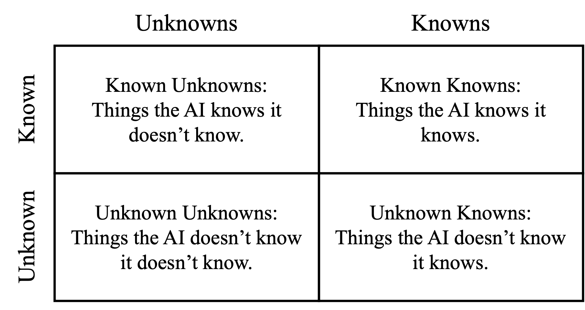
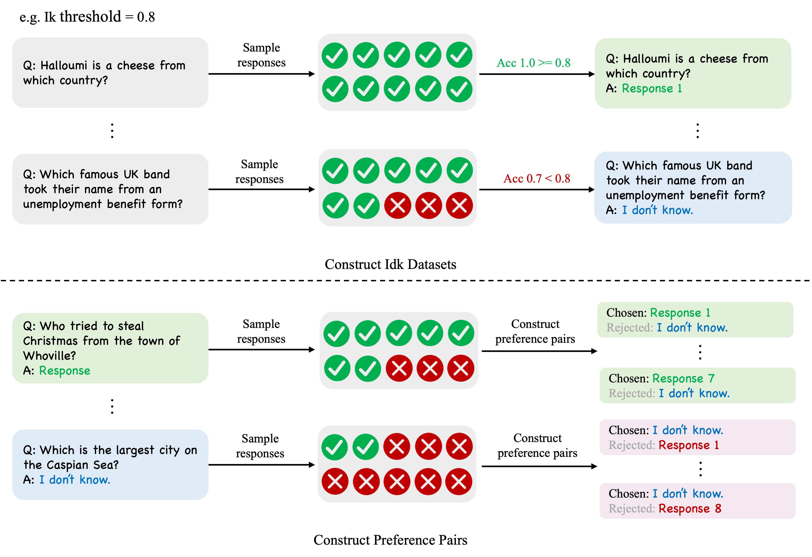
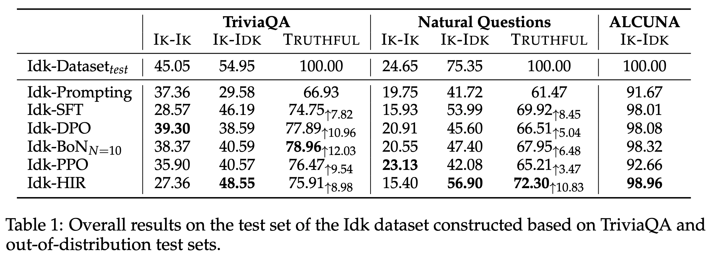

# Say-I-Dont-Know
## Introduction
The "Say-I-Dont-Know" project primarily investigates whether AI assistants based on large language models can perceive the boundaries of their own knowledge and express this understanding through natural language. 
This repository contains the code, data and model checkpoints for our paper "[Can AI Assistants Know What They Don't Know?](https://arxiv.org/pdf/2401.13275.pdf)".



The AI assistant’s perception of its own knowledge can be represented through knowledge quadrants.
The knowledge quadrant is a partition which can divide the knowledge into four categories: Known Knowns, Known Unknowns, Unknown Knowns and Unknown Unknowns, as shown in the Figure above.
In this project, we develope model-specific Idk ("I don't know") dataset for the AI assistant, and by utilizing this Idk dataset, we aim to align the assistant to refuse answering questions that it does not know and answer questions that it knows.
Consequently, this transforms knowledge from Unknown-Unknowns and Unknown-Knowns to Known-Knowns and Known-Unknowns, thereby enhancing the truthfulness of the AI assistant.

## Idk Dataset and Preference Data

The process of constructing Idk dataset and preference data is shown in the Figure above. We release four Idk datasets, corresponding to Llama-2-7b-chat, Baichuan2-7B-Chat, Mistral-7B-Instruct-v0.1, and Llama-2-70b-chat. We also release the preference data for Llama-2-7b-chat when the Ik threshold is set to 1.0.

## Teaching AI Assistants to Say I Don't Know
Our code is primarily based on [llama-recipes](https://github.com/facebookresearch/llama-recipes), [DPO](https://github.com/eric-mitchell/direct-preference-optimization) and [DeepSpeed-Chat](https://github.com/microsoft/DeepSpeedExamples/tree/master/applications/DeepSpeed-Chat).

### Preparing the Environment
```bash
git clone https://github.com/OpenMOSS/Say-I-Dont-Know.git
cd Say-I-Dont-Know
pip install -U pip setuptools
pip install --extra-index-url https://download.pytorch.org/whl/test/cu118 -e .
```

### Preprocessing the Idk Dataset
See [Idk_datasets/README.md](Idk_datasets) for details.

### Idk-Prompting
Idk-Prompting directly instruct the AI assistant to refuse its unknown questions through prompts.
You can use the following command to generate responses with Idk-Prompting.
```python
python src/Inference/infer_llama.py \
    --model_name meta-llama/Llama-2-7b-chat-hf \
    --batch_size 2 \
    --save_name outputs/triviaqa_test_llama_2_7b_chat_threshold_1.0_idk_prompt_greedy_infer.json \
    --prompt_file Idk_datasets/sft_data/llama-2-7b-chat/triviaqa_test_threshold_1.0_sft_data.json \
    --response_num 1 \
    --top_k 1 \
    --idk_prompt True
```

### Idk-SFT
You can use the following command to train an Idk-SFT model. 
```python
torchrun --nproc_per_node=4 \
    --nnodes=1 \
    src/llama_recipes/finetuning.py \
    --enable_fsdp \
    --model_name meta-llama/Llama-2-7b-chat-hf \
    --dist_checkpoint_root_folder model_checkpoints \
    --dist_checkpoint_folder llama_2_7b_chat_Idk_sft \
    --fsdp_config.pure_bf16 \
    --dataset Triviaqa_llama2_7b_chat_threshold_1_0 \
    --gradient_accumulation_steps 2 \
    --batch_size_training 4 \
    --num_epochs 10 \
    --lr 2e-5
```

After training, you need to convert the fsdp checkpoint to a consloidated checkpoint, using the following command:
```python
python -m llama_recipes.inference.checkpoint_converter_fsdp_hf \
    --fsdp_checkpoint_path <your_fsdp_checkpoints_path> \
    --consolidated_model_path <your_consolidated_model_path> \
    --HF_model_path_or_name <your_initial_hf_model_path_or_name>
```

At last, you can use the following command to generate responses.
```python
python src/Inference/infer_llama.py \
    --model_name <your_result_model> \
    --batch_size 2 \
    --save_name outputs/triviaqa_test_llama_2_7b_chat_threshold_1.0_idk_sft_greedy_infer.json \
    --prompt_file Idk_datasets/sft_data/llama-2-7b-chat/triviaqa_test_threshold_1.0_sft_data.json \
    --response_num 1 \
    --top_k 1
```


### Idk-BoN
To implement Best-of-N sampling, we first train an Idk-SFT model using half of the Idk dataset. Then, we use the trained model to perform sampling on the other half of the Idk data in order to collect preference data. Finally, we utlize the Idk-SFT to initialize a reward model, and train the reward model using the preference data. During inference, we use the reward model to perform Best-of-N sampling.

**Train an Idk-SFT model with half of the Idk dataset**
```python
torchrun --nproc_per_node=4 \
    --nnodes=1 \
    src/llama_recipes/finetuning.py \
    --enable_fsdp \
    --model_name meta-llama/Llama-2-7b-chat-hf \
    --dist_checkpoint_root_folder model_checkpoints \
    --dist_checkpoint_folder llama_2_7b_chat_Idk_sft_half_data \
    --fsdp_config.pure_bf16 \
    --dataset Triviaqa_llama2_7b_chat_threshold_1_0_half_data \
    --gradient_accumulation_steps 2 \
    --batch_size_training 4 \
    --num_epochs 10 \
    --lr 2e-5
```

**Train a reward model with the preference data**  
You need to first process the preference data for reward modeling.
```python
cd Idk_datasets
python process_preference_data.py
cd ..
```

Then you can train the reward model.  
```python
torchrun --nproc_per_node 4 \
    src/llama_recipes/finetuning.py \
    --enable_fsdp \
    --model_name <Idk_SFT_model> \
    --dist_checkpoint_root_folder model_checkpoints \
    --dist_checkpoint_folder llama_2_7b_chat_reward_model \
    --fsdp_config.pure_bf16 \
    --dataset Triviaqa_llama2_7b_chat_threshold_1_0_preference_data \
    --batch_size_training 32 \
    --batching_strategy padding \
    --lr 9e-6 \
    --num_epochs 1 \
    --train_ppo_reward_model \
    --val_batch_size 2
```

After training, you need to convert the fsdp checkpoint to a consloidated checkpoint, using the following command:
```python
python -m llama_recipes.inference.checkpoint_converter_fsdp_hf \
    --fsdp_checkpoint_path <your_fsdp_checkpoints_path> \
    --consolidated_model_path <your_consolidated_model_path> \
    --HF_model_path_or_name <your_initial_hf_model_path_or_name> \
    --reward_model True
```

**Generation using best-of-n sampling**  
First sampling ten candidates for each question.
```python
python src/Inference/infer_llama.py \
    --model_name meta-llama/Llama-2-7b-chat-hf \
    --batch_size 2 \
    --save_name outputs/triviaqa_test_llama_2_7b_chat_threshold_1.0_infer_10_candidates.json \
    --prompt_file Idk_datasets/sft_data/llama-2-7b-chat/triviaqa_test_threshold_1.0_sft_data.json \
    --response_num 10
```

Then using the reward model to select the best response for each question.
```python
python infer_reward_model.py \
    --model_name <your_reward_model> \
    --batch_size 1 \
    --save_name <output_file_path> \
    --prompt_file outputs/triviaqa_test_llama_2_7b_chat_threshold_1.0_infer_10_candidates.json \
    --reject_sampling True
```

### Idk-DPO
To implement, we use the same SFT model and preference data as we used in Idk-BoN. We train Idk-DPO using 8 * 80G A100 GPUs.
```python
python -u src/dpo/train.py model=blank_model \
    model.name_or_path=result_model \
    model.block_name=LlamaDecoderLayer  \
    datasets=[triviaqa] \
    loss=dpo \
    loss.beta=0.1 \
    loss.sft_coef_when_dpo=0.01 \
    exp_name=llama2-7b-chat_Idk_DPO \
    gradient_accumulation_steps=4 \
    batch_size=64 \
    eval_batch_size=32 \
    trainer=FSDPTrainer \
    sample_during_eval=false \
    model.fsdp_policy_mp=bfloat16
```
The final weights will be saved to path like `.cache/YOUR_USERNAME/llama2-7b-chat_Idk_DPO_2024-01-29_22-19-44_117975/step-BEST/policy.pt`. You can generate responses using the same commands as in Idk-SFT.

### Idk-PPO
You can conduct Idk-PPO training using the following command.
```bash
bash src/deepspeed-chat-ppo/train.sh <output_dir> <actor_model_path> <reward_model_path> <data_path>
```
You can generate responses using the same commands as in Idk-SFT.

### Idk-HIR
You need to first relabel Idk datasets, as shown in [Idk_datasets](Idk_datasets/README.md). Then you can use the following command to train an Idk-HIR model.
```python
torchrun --nproc_per_node=8 \
    --nnodes=1 \
    src/llama_recipes/finetuning.py \
    --enable_fsdp \
    --model_name meta-llama/Llama-2-7b-chat-hf \
    --dist_checkpoint_root_folder model_checkpoints \
    --dist_checkpoint_folder llama_2_7b_chat_Idk_hir \
    --fsdp_config.pure_bf16 \
    --dataset Triviaqa_llama2_7b_chat_hir \
    --batch_size_training 32 \
    --batching_strategy padding \
    --num_epochs 3 \
    --lr 2e-5
```

## Evaluation

Our model ouputs can be found at [outputs](outputs). You can use the following command to evaluate the results.
```python
python src/evaluation/cal_knowledge_quadrants.py --file_name outputs/triviaqa_test_llama2_7b_chat_idk_sft.json
```
You will get the following results:
```
Ik-Ik: 38.37
Ik-Idk: 40.59
Idk-Ik: 11.53
Idk-Idk: 9.51
Truthful: 78.96
```

## Acknowledgements
- I especially thank Tianxiang Sun, Xiangyang Liu , Wenwei Zhang and other co-authors for their guidance and help. I really enjoy the teamwork with them.
- Thanks to my advisor, Prof. Xipeng Qiu, for his guidance, support, helping me persevere and complete this work.
- I am also grateful to Xinyang Pu for her support. I know we'll both make it through.

## Citation
```
@misc{cheng2024ai,
      title={Can AI Assistants Know What They Don't Know?}, 
      author={Qinyuan Cheng and Tianxiang Sun and Xiangyang Liu and Wenwei Zhang and Zhangyue Yin and Shimin Li and Linyang Li and Zhengfu He and Kai Chen and Xipeng Qiu},
      year={2024},
      eprint={2401.13275},
      archivePrefix={arXiv},
      primaryClass={cs.CL}
}
```